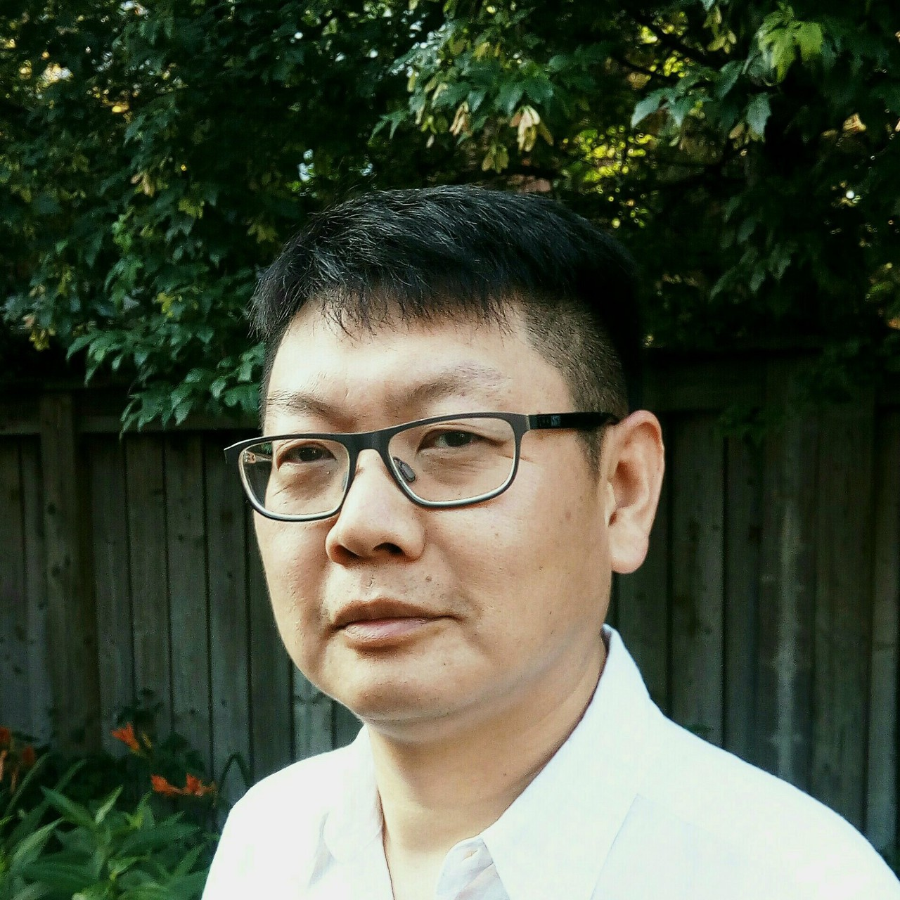
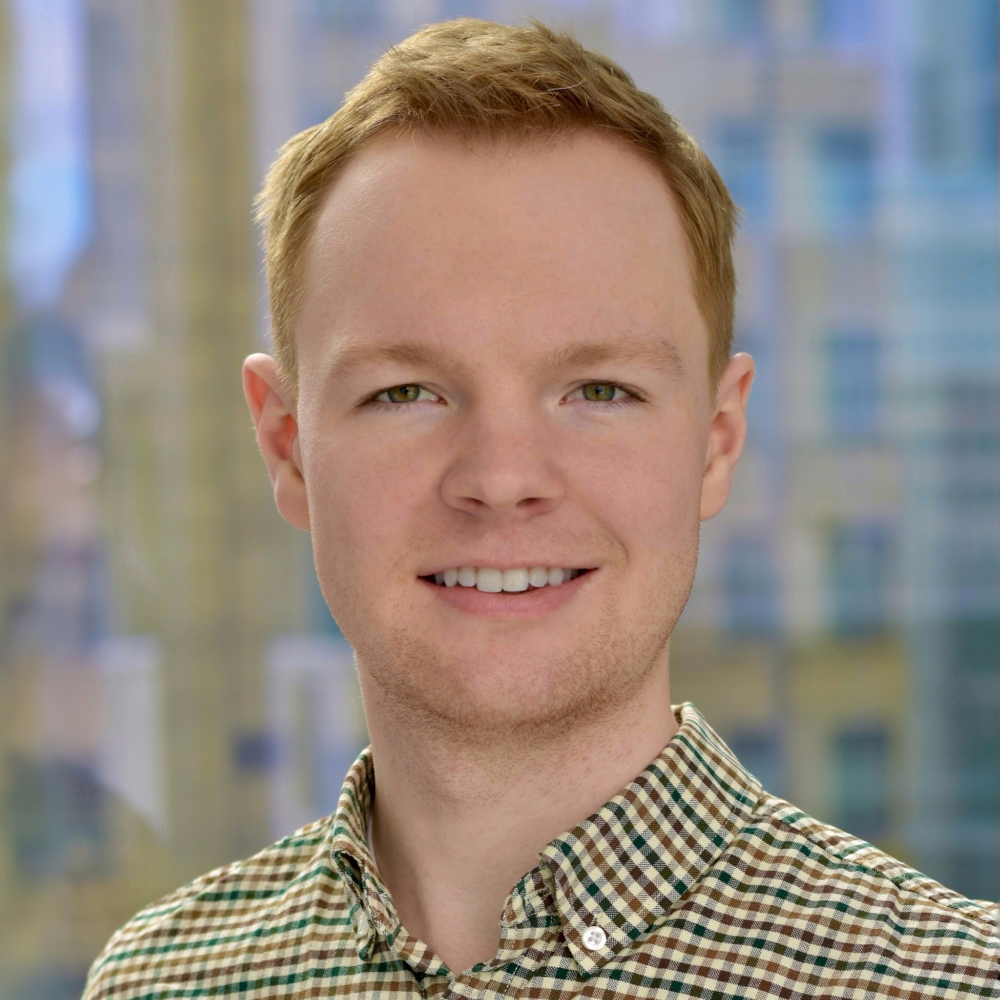

# Meet Your Faculty

<!--#### NAME

>JOB TITLE  
INSTITUTION  
LOCATION
>
> --- CONTACT INFO, IF PROVIDED

BIO GOES HERE-->

#### Zhibin Lu

>
HPC and Bioinformatics Services Manager 
Princess Margaret Cancer Centre 
Ontario
>
> --- zhibin@gmail.com

Zhibin manages the two UHN clusters under HPC4Health, Compute Canada. He is also members of Compute Canada Bioinformatics team and scheduling team. He is responsible for project management, system administration, NGS data analysis at PMCC.

#### Ben Fisher

>
Regional Coordinator, CBH Atlantic 
Canadian Bioinformatics Hub, Dalhousie University 
Halifax, NS, Canada
>
> --- atlantic@bioinformatics.ca

Ben has a Master of Science degree in Microbiology and Immunology, completing his bioinformatics training under Dr. Morgan Langille at Dalhousie University. Throughout his training, he has instructed others in genetics, molecular biology, and microbiome data science. Ben is passionate about continued education of trainees and professionals, and firmly believes that enhancing bioinformatics and computational biology competencies will support the success of Canada’s current and future scientists.
